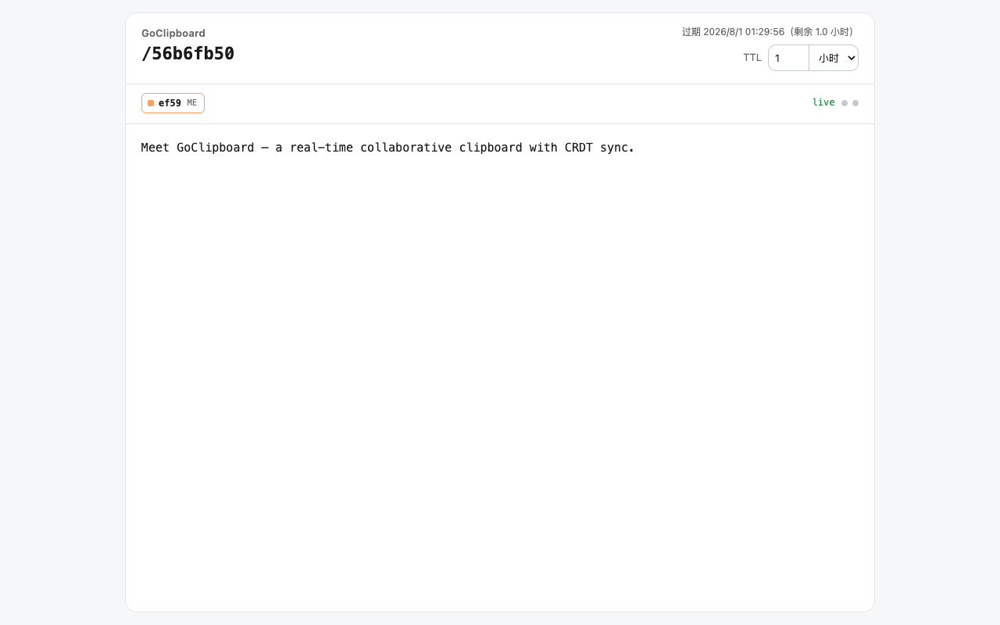

<div align="center">


# GoClipboard

**一个轻量、实时协作的临时云剪贴板 —— 单个二进制即可自托管。**

分享文本和文件，只需要一个 URL。内容实时同步，到期自动销毁。

[English](README.en.md) | 简体中文


[](https://linux.do)

</div>

---

## 为什么需要它？

密码、SSH key、一行命令、配置片段、随手要发的截图——把内容从一台机器弄到另一台机器，不应该需要注册账号、登录流程，或者再装一个记笔记的 App。

GoClipboard 给你一个 **URL**：把内容贴进房间，分享链接，所有打开的人实时看到同步结果。它到期自动清理、没有数据库、整个服务就是一个静态二进制，跑在任何机器上。

## ✨ 特性

- ⚡ **单二进制、零运行时依赖** —— Go 静态编译约 10 MB，Docker 镜像直接基于 `scratch`
- 🔗 **URL 即分享** —— 每个剪贴板随机生成 key，TTL 按分钟/小时/天设定，到期自动清理
- 👥 **实时协作编辑** —— 基于字符级 **RGA CRDT**，通过 WebSocket 同步：多人并发编辑自动合并，互不覆盖，弱网也不怕
- 🖱️ **远程光标与选区** —— 实时看到协作者的输入位置，每人一个专属颜色
- 📁 **房间文件分享** —— 拖入文件即得链接；落盘存储，每个文件独立下载密码，上传/删除需管理员密码
- 🔐 **密码只存哈希** —— 文件密码仅保存 salt + SHA-256
- 🚦 **防滥用** —— 按 IP 限流 + 自适应黑名单，扫描者自动封禁 30 分钟
- 🧹 **内存自限** —— 内存预算封顶；写满时返回 `HTTP 507` + `Retry-After`
- 📊 **可运维** —— 结构化 JSON 日志、`/healthz` 健康检查、优雅停机
- 🐳 **部署简单** —— 多架构 Docker 构建，`docker compose up` 一条命令
- 🇨🇳 **中文界面** —— 简洁的单页前端，无框架、无构建步骤

## 🖼️ 界面截图



## 🚀 快速开始

```sh
go run .
# 或
make run
```

打开 **http://localhost:8080** —— 自动跳转到一个全新的剪贴板，完事。

```sh
docker compose up -d          # 用 Docker 自托管
```

## 🧠 工作原理：CRDT，而不是后写覆盖

文本编辑通常是场"打架"：两个人同时输入，后写的人覆盖先写的人。GoClipboard 用**字符级 CRDT**（insert-after RGA）绕开了这个问题：

- 每个字符是一个原子：`id = clientId:clock`（Lamport 时间戳），带 `parent` 指针。
- 并发插入在 **Unicode 码点**粒度合并 —— 不存在整串后写覆盖。
- 兄弟节点顺序确定：clock 大者在前，再按站点 id 排序，所以中段插入总是待在光标旁边。
- 删除是墓碑（tombstone），房间 TTL 到期时统一回收。
- 实时输入以 WebSocket **ops** 增量同步；迟到者收到完整 **state** 快照；断线重连自动合并。
- REST `PUT` 仍可整篇替换（支持 `baseVersion` 乐观并发，冲突返回 `409`），适合简单客户端和离线兜底。

这也是弱网下依然稳定的原因：op 幂等、与顺序无关、重发成本极低。

## 🔌 API

### 剪贴板（REST）

```http
GET    /api/clipboard/{key}              # 读取内容 + 版本
PUT    /api/clipboard/{key}              # 整篇替换
DELETE /api/clipboard/{key}              # 删除
```

```sh
curl -X PUT localhost:8080/api/clipboard/AbC123 \
  -H 'Content-Type: application/json' \
  -d '{"content":"hello 世界","ttlSeconds":3600,"clientId":"my-site"}'
```

`PUT` 支持可选的 `baseVersion` 乐观并发：过期覆盖会被拒绝并返回 `409`（附当前状态），离线/REST 客户端可以据此合并而不是盲目覆盖。

### 实时同步（WebSocket）

```http
GET /api/clipboard/{key}/ws?clientId={id}
```

**服务端 → 客户端**

| type     | 含义                                              |
|----------|---------------------------------------------------|
| `state`  | 完整 CRDT 快照：`items`、线性化 `content`、版本号 |
| `ops`    | 已应用的 op 批次 + `version` / `content`          |
| `cursor` | 远程光标 / 选区（码点偏移）                       |
| `files`  | 文件列表元数据（上传/删除/过期后推送）            |

**客户端 → 服务端**

```json
{"type":"ops","ops":[{"op":"ins","id":"a:1","after":"","ch":"x"}],"ttlSeconds":3600}
{"type":"cursor","cursorPos":0,"selectionEnd":0,"color":"#61afef"}
```

op 类型：`ins`（`id`、`after`、`ch` —— 恰好一个码点）与 `del`（`id`）。

**限制：** 内容 ≤ 1 MiB · 每批 ≤ 4096 ops · 每条 WS 消息 ≤ 256 KiB。

### 文件分享

| 操作                                  | 鉴权                                  |
|---------------------------------------|---------------------------------------|
| `GET  /files`                         | 公开（有房间 URL 即可）               |
| `POST /files`（multipart）            | 房间开放 → 文件密码；未开放 → 管理员密码 + 文件密码 |
| `GET  /files/{id}`                    | 该文件的密码（`X-File-Password` 或 `?filePassword=` / `?password=`） |
| `DELETE /files/{id}`                  | 管理员密码                            |
| `GET/PUT /settings`（上传开关）       | 管理员密码                            |

房间默认**关闭上传**。管理员**三击房间名**（路径）即可切换开关，设置持久化在磁盘上。文件随房间 TTL 一起过期。管理员密码来自 `UPLOAD_PASSWORD`；留空则整个文件功能停用。

### 健康检查

```http
GET /healthz
```

Docker 部署时容器健康检查直接调用二进制自身（scratch 镜像没有 curl/wget）：

```sh
/goclipboard -healthcheck   # 探测本机 /healthz，成功退出码 0
```

## ⚙️ 配置

全部通过环境变量：

| 变量                    | 默认值    | 说明                                                        |
|-------------------------|-----------|-------------------------------------------------------------|
| `PORT`                  | `8080`    | 监听端口                                                    |
| `MAX_ROOMS`             | `10000`   | 最大存活房间数（内存中）                                    |
| `MAX_MEMORY_MB`         | `256`     | 内容 + CRDT 原子的内存预算，超出返回 `507`                  |
| `UPLOAD_PASSWORD`       | _(空)_    | 文件上传/删除的管理员密码；留空停用文件功能                  |
| `FILE_DIR`              | `data/files` | 上传文件的磁盘根目录（`{FILE_DIR}/{room}/{id}.bin`）     |
| `TRUSTED_PROXIES`       | _(空)_    | 可信反向代理 CIDR 列表（逗号分隔，如 `127.0.0.1/32,10.0.0.0/8`）。为空时**不信任任何转发头**（`X-Forwarded-For`/`X-Real-IP` 一律忽略，限流/黑名单按直连 IP 计算），防止伪造头绕过限流或误封他人 |
| `MAX_WS_CONNS`          | `512`     | WebSocket 全局并发连接上限，超出返回 `503`                  |
| `MAX_WS_CONNS_PER_IP`   | `32`      | 单 IP 的 WebSocket 并发连接上限                             |
| `WS_MSG_RATE`           | `50`      | 单连接入站消息令牌速率（条/秒）；超限断开连接（客户端会自动重连并同步） |
| `WS_MSG_BURST`          | `100`     | 单连接入站消息突发预算                                      |

运维默认值：限流 10 req/s（burst 20）、自适应黑名单（硬阈值 5、扫描阈值 10、窗口 30 s、封禁 30 分钟）、每分钟清理一轮、优雅停机 10 秒。WebSocket 通道有连接数上限与单连接消息限速（默认值对正常多人编辑留有充足余量：客户端打字约 17 msg/s + 光标约 13 msg/s）。

> 部署在反向代理后面时，请把代理地址加入 `TRUSTED_PROXIES`，并让代理**覆写**（而非追加）`X-Forwarded-For`（nginx 示例：`proxy_set_header X-Forwarded-For $remote_addr;`）。

## 🐳 Docker

```sh
docker compose up -d
```

多架构（`linux/amd64`、`linux/arm64` 等）`scratch` 镜像——无 shell、无 libc，只有二进制和 CA 证书。自带健康检查，数据持久化在命名卷中。

## 🛠️ 开发

```sh
make run          # 开发服务器 :8080
make test         # go test ./...
make test-js      # 前端 crdt.js 交叉收敛测试（需 node）
make test-cover   # 覆盖率报告 → coverage.html
make build        # 编译单个静态二进制
```

代码量小，结构刻意保持朴素：

```
main.go               入口：配置、中间件、优雅停机
internal/crdt/        RGA 序列 CRDT（插入 / 删除 / 物化 / 快照）
internal/store/       内存房间存储 + 磁盘文件存储、TTL 清理
internal/handler/     HTTP + WebSocket 路由、文件上传下载
internal/middleware/  限流、黑名单、安全头、请求日志
static/               前端：app.js + crdt.js（原生 JS，无构建步骤）
```

## 📜 License

本项目基于 [MIT](LICENSE) 协议开源 —— 详见 [LICENSE](LICENSE) 文件。
